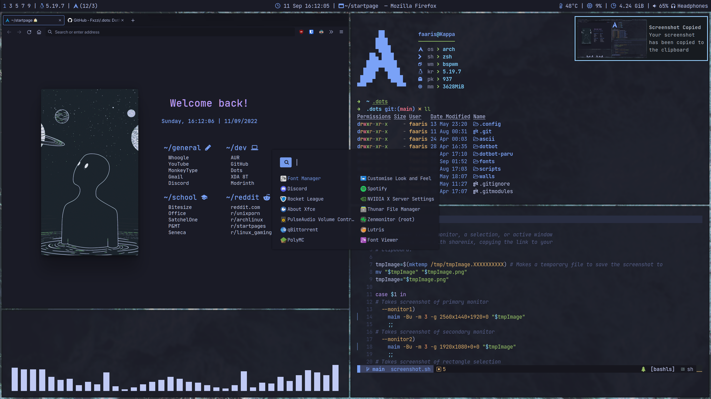

# ⚈ dotfiles

### 🔷 by fazzi.
### 🌃 based on the tokyonight color scheme.

<p align="center">
  
</p>

- **Distribution:** [arch btw](https://archlinux.org/)
- **Compositor:** [Hyprland](https://github.com/hyprwm/Hyprland)
- **Terminal Emulator:** [foot-transparency](https://codeberg.org/fazzi/foot)
- **Status Bar:** [waybar](https://github.com/Alexays/Waybar/)
- **App Launcher:** [wofi](https://hg.sr.ht/~scoopta/wofi)
- **Notification Daemon:** [dunst](https://github.com/dunst-project/dunst)
- **Shell:** [zsh](https://www.zsh.org/)
- **Shell Plugin Manager:** [zgenom](https://github.com/jandamm/zgenom)
- **Browser:** [LibreWolf](https://librewolf.net/)

## 📁 Installation

Make sure you install GNU Stow. To do this on Arch, run
```bash
sudo pacman -S stow
```


```bash
git clone https://gitlab.com/fazzi/dotfiles.git
cd dotfiles
stow .
```

This will set-up symlinks to the correct locations. It will also install zsh, paru, and other packages. **PLEASE BACKUP YOUR OWN CONFIGS BEFORE PROCEEDING!**

## 🖥️ Wallpapers

Browse through the collection of wallpapers in the [walls repo.](https://gitlab.com/fazzi/walls "walls repo").
